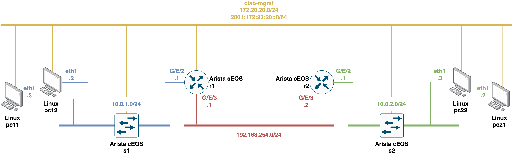
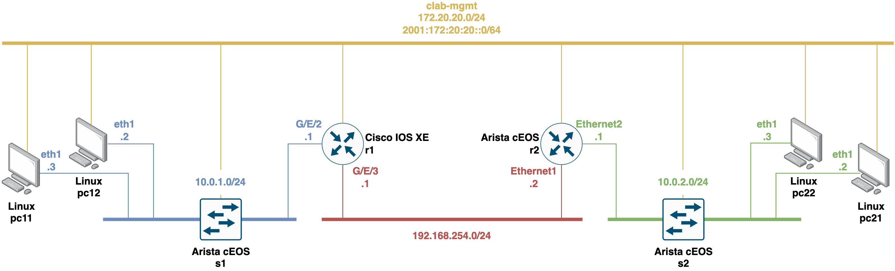

<!-- omit from toc -->
# Containerlab testbeds for studying and analyzing RESTCONF and CORECONF model-driven network management protocols.

These [Containerlab](https://containerlab.dev/) scenarios allow users to study and analyze with network management mechanisms using the RESTCONF and CORECONF protocols and YANG data modeling language.

<!-- omit from toc -->
## Table of Contents
<!-- TOC -->
- [Deploying, playing with, and destroying a network topology composed of Arista cEOS network devices](#deploying-playing-with-and-destroying-a-network-topology-composed-of-arista-ceos-network-devices)
  - [Building custom Docker image for Linux clients](#building-custom-docker-image-for-linux-clients)
  - [Deploying the network topology](#deploying-the-network-topology)
  - [Interacting with containers](#interacting-with-containers)
  - [Managing Arista cEOS routers with RESTCONF](#managing-arista-ceos-routers-with-restconf)
  - [Destroying the network topology](#destroying-the-network-topology)
- [Deploying, playing with, and destroying a network topology composed of both Arista cEOS and Cisco IOS XE CSR1000v network devices](#deploying-playing-with-and-destroying-a-network-topology-composed-of-both-arista-ceos-and-cisco-ios-xe-csr1000v-network-devices)
  - [Deploying the network topology](#deploying-the-network-topology-1)
  - [Interacting with Cisco IOS XE CSR1000v containers](#interacting-with-cisco-ios-xe-csr1000v-containers)
  - [Managing Cisco IOS XE CSR1000v routers with RESTCONF](#managing-cisco-ios-xe-csr1000v-routers-with-restconf)
  - [Destroying the network topology](#destroying-the-network-topology-1)
<!-- /TOC -->

## Deploying, playing with, and destroying a network topology composed of Arista cEOS network devices

This Containerlab network scenario consists of two routers (i.e., `r1` and `r2`), two switches (i.e., `s1` and `s2`), and four hosts (i.e., `pc11`, `pc12`, `pc21`, and `pc22`). Both routers and switches use the Arista cEOS network operating system.



### Building custom Docker image for Linux clients

To build the custom Docker image for client end-hosts (i.e., `pc11`, `pc12`, `pc21`, and `pc22`), follow the steps below:
```
$ cd docker/
$ sudo docker build -t giros-dit/clab-telemetry-testbed-ubuntu:latest .
```

### Deploying the network topology

Before starting the Containerlab scenario it is necessary to import the [Arista cEOS](https://containerlab.dev/manual/kinds/ceos/) docker image. Specifically, the scenario uses one of the latest available Arista cEOS versions `cEOS-lab-4.34.4M`. Download it first from the [Arista software section](https://www.arista.com/en/support/software-download) (it is the 64-bit version).

The command to import the image is:
```bash
$ docker import cEOS64-lab-4.34.4M.tar ceos:4.34.4M
```

To deploy the network topology, simply run the deploy shell script:
```
$ ./deploy-testbed-arista-ceos-lab.sh
```

### Interacting with containers

For **Arista cEOS routers/switches**, via SSH to open the CLI (password is `admin`):
```
$ ssh admin@clab-telemetry-testbed-arista-ceos-lab-r1 # For r1 router
```

, or with `docker exec` to open the interactive CLI:
```
$ sudo docker exec -it clab-telemetry-testbed-arista-ceos-lab-r1 Cli # For r1 router
```

You can also open an interactive `bash` Linux shell with `docker exec`:
```
$ sudo docker exec -it clab-telemetry-testbed-arista-ceos-lab-r1 bash # For r1 router
```

For **Linux containers (clients)**, with `docker exec` to open an interactive shell:
```
$ sudo docker exec -it clab-telemetry-testbed-arista-ceos-lab-pc11 bash # For pc11 client container
```

### Managing Arista cEOS routers with RESTCONF

The router devices of the network topology (i.e., `r1` and `r2`) are configured in the startup files to be managed using the RESTCONF network management protocol. 

>**Note**: The Arista cEOS network operating system, which is used by the router devices in this network scenario, supports the YANG data modeling language and the RESTCONF protocol for OpenConfig YANG data models. It also supports the JSON data encoding format, but not the XML.

The following is an example of a RESTCONF query operation that requests configuration and operational state information about the *Ethernet1* network interface of the router `r1` using the cURL tool: 
```bash
curl -s GET 'https://clab-telemetry-testbed-arista-ceos-lab-r1:5900/restconf/data/openconfig-interfaces:interfaces/interface=Ethernet1' --header 'Accept: application/yang-data+json' -u admin:admin  --insecure
```

>**Note**: The following site contains a collection of notes, examples, and documentation regarding the use of RESTCONF network management protocols with Arista cEOS devices: https://aristanetworks.github.io/openmgmt/

### Destroying the network topology

To destroy the network topology, simply run the destroy shell script:
```
$ ./destroy-testbed-arista-ceos-lab.sh
```

## Deploying, playing with, and destroying a network topology composed of both Arista cEOS and Cisco IOS XE CSR1000v network devices

There is an alternative Containerlab network scenario where the router `r1` uses the Cisco IOS XE CSR1000v operating system.



### Deploying the network topology

Before starting the Containerlab scenario it is necessary to use a [Cisco IOS XE CSR1000v](https://containerlab.dev/manual/kinds/vr-csr/) docker image. At the link above on the official Containerlab website, you will find information on how to generate the packaged Docker container image from a Qemu virtual machine image using the [vrnetlab](https://github.com/srl-labs/vrnetlab) tool. 

>**Note**: You will need a Qemu virtual machine image available for the Cisco XE CSR1000v network operating system with a compatible license. Specifically, the scenario uses release `17.3.4a` of Cisco IOS XE CSR1000v (a.k.a. 17.03.04a). 

Once the images of all the containers are available, to deploy the network topology, simply run the deploy shell script:
```
$ ./deploy-testbed-cisco-xe-arista-ceos-lab.sh
```

> **Note:** Once the network scenario is deployed with `Containerlab`, the container of the `Cisco IOS XE CSR1000v` router node (i.e., `r1`) take approximately 2-4 minutes to boot and load the default configuration accordingly (depending on your machine's computing resources). To determine when the container `r1` is ready, you can use the `docker logs -f clab-telemetry-testbed-cisco-xe-arista-ceos-lab-r1` command, which shows logs of the router's startup and configuration process. Once a log appears with the message `INFO Startup complete in: <TIME>`, the process of starting and configuring the router container will have finished.

### Interacting with Cisco IOS XE CSR1000v containers

For **Cisco IOS XE CSR1000v router**, via SSH to open the CLI (password is `admin`):
```
$ ssh admin@clab-telemetry-testbed-cisco-xe-arista-ceos-lab-r1
```

, or with `docker exec` to open an interactive `bash` Linux shell:
```
$ sudo docker exec -it clab-telemetry-testbed-cisco-xe-arista-ceos-lab-r1 bash
```

### Managing Cisco IOS XE CSR1000v routers with RESTCONF

The router devices of the network topology (i.e., `r1` and `r2`) are configured in the startup files to be managed using the RESTCONF network management protocol. 

>**Note**: The Cisco IOS XE CSR1000v network operating system, which is used by the router `r1`in this network scenario, supports the YANG data modeling language and the RESTCONF protocol for OpenConfig YANG data models. It also supports both the JSON and XML data encoding formats.

The following is an example of a RESTCONF query operation using the cURL tool and JSON data encoding format to request configuration information about all the network interfaces of the router `r1`:
```bash
curl -s GET 'https://clab-telemetry-testbed-cisco-xe-arista-ceos-lab-r1/restconf/data/ietf-interfaces:interfaces' --header 'Accept: application/yang-data+json' -u admin:admin  --insecure 
```

The following is an example of the same query operation, but using XML data encoding:
```bash
curl -s GET 'https://clab-telemetry-testbed-cisco-xe-arista-ceos-lab-r1/restconf/data/ietf-interfaces:interfaces' --header 'Accept: application/yang-data+xml' -u admin:admin  --insecure 
```

The following is an example of a RESTCONF query operation using the cURL tool and JSON data encoding format to request operational state information about all the network interfaces of the router `r1`:
```bash
curl -s GET 'https://clab-telemetry-testbed-cisco-xe-arista-ceos-lab-r1/restconf/data/ietf-interfaces:interfaces-state' --header 'Accept: application/yang-data+json' -u admin:admin  --insecure 
```

The following is an example of the same query operation, but using XML data encoding:
```bash
curl -s GET 'https://clab-telemetry-testbed-cisco-xe-arista-ceos-lab-r1/restconf/data/ietf-interfaces:interfaces-state' --header 'Accept: application/yang-data+xml' -u admin:admin  --insecure 
```

### Destroying the network topology

To destroy the network topology, simply run the destroy shell script:
```
$ ./destroy-testbed-cisco-xe-arista-ceos-lab.sh
```